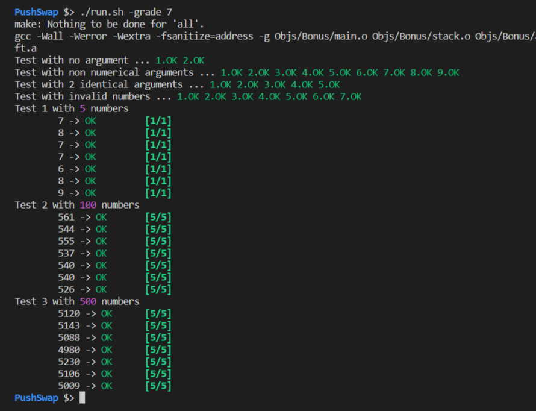

# Push_Swap_Tester

Little tester to facilitate evaluations

Currently has tests for `checker` and `push_swap` executables.

Disclaimer : the tests were disigned for private use and may not be compatible with your Makefile and whatnot.  Passing this tester doesn't mean the project is error-free.

## Table of Contents
1. [Purpose](#purpose)
2. [Install](#install)
3. [Commands](#Commands)

## Purpose:

There are many examples to check during a push_swap evaluation, which leaves less time to review the code itself, which .. is a `shame`.  In order to counter this problematic I made a simple tester kind enough to generate lists of random numbers and checking if the executable fills its role correctly.  I also added a bunch of wrong inputs to check whether the errors are handled.  Cheers.

#### Example execution:



## Install:

In order to clone this tester, go to the root of your push_swap directory, and use the following commands :

```
git clone git@github.com:GitHuberlandYann/Push_Swap_Tester.git
mv Push_Swap_Tester/* .
```

You will now be able to use the `run.sh` executable as shown bellow.

### Troubleshooting:

- **./checker: Exec format error**: If you are using linux, rename the following file:
```
mv checker_linux checker
```
- **ruby: not found**: This tester needs ruby to run. Install it via your package manager, for example for debian/ubuntu
```
sudo apt install ruby
```

## Commands:

In general, I am using your Makefile in order to generate the files I am using, so make sure the executables' name are `push_swap` and `checker` for your main and bonus parts.

Here are some examples of commands this tester accepts

```
/Push_Swap $> ./run.sh                        # Execute 5 tests with lists of 5, 10, 50, 100, and 500 numbers

/Push_Swap $> ./run.sh <number>               # Execute <number> of tests with lists of 5, 10, 50, 100, and 500 numbers

/Push_Swap $> ./run.sh parrot                 # Curiosity killed the cat

/Push_Swap $> ./run.sh <numberA> <numberB>    # Execute <numberA> of tests with a list of <numberB> numbers, then display best and worst cases

/Push_Swap $> ./run.sh -c <path_to_checker>   # Execute tests with good and bad inputs on the checker provided by <path_to_checker>

/Push_Swap $> ./run.sh -g                     # Execute error tests on the executables then 5 tests with lists of 5, 100, and 500 numbers + grade

/Push_Swap $> ./run.sh -g <number>            # Execute error tests on the executables then <number> of tests with lists of 5, 100, and 500 numbers + grade

```
